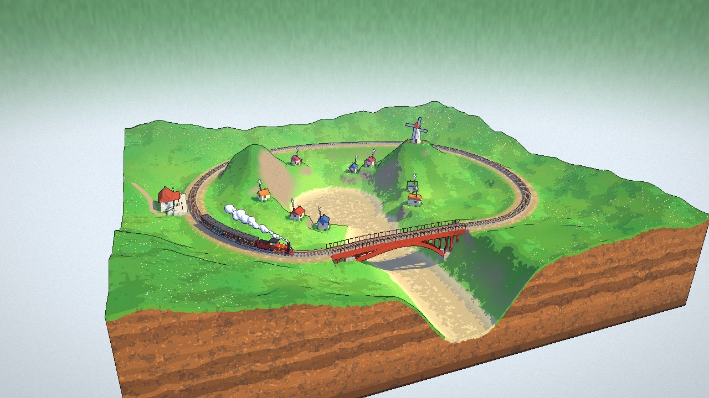
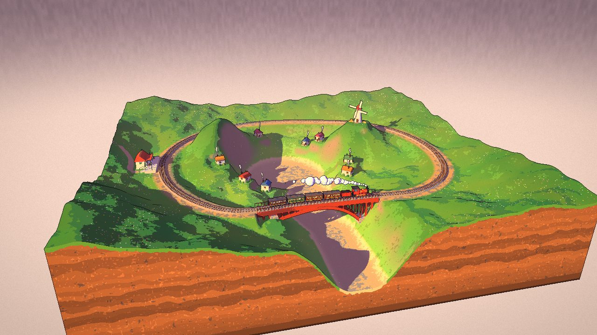
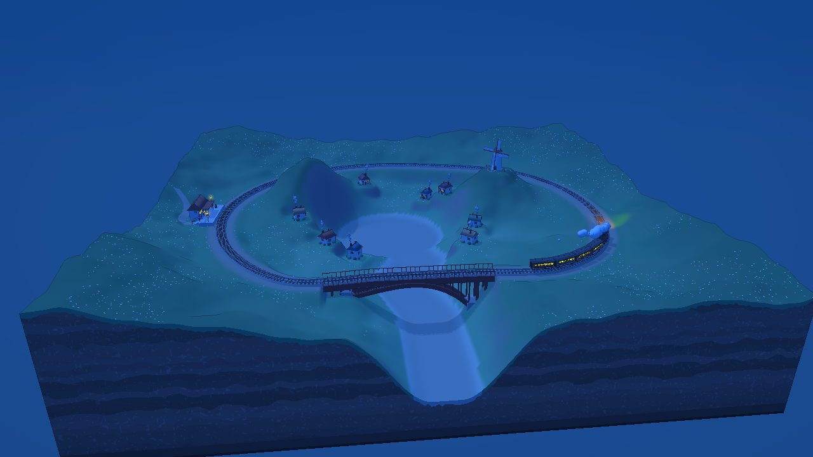
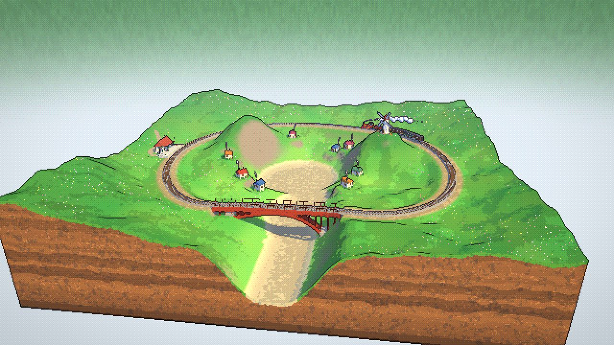

# Train Diorama

An independent, from-scratch re-implementation of a vanilla three.js train-diorama scene — a
floating low-poly valley with a looping steam train, toon shading and a painterly stipple style.
No code or artwork is copied from the original; it is used only as a private behavioural
reference. The logo and favicon in `assets/` are this repository's own original artwork.

**Live demo:** https://tranhuuhuy297.github.io/train-diorama/ (work in progress)



| Evening | Night | Pixel art (360p) |
|---|---|---|
|  |  |  |

**Status:** terrain, track, bridge, station, village, windmill, steam train, time of day, ink lines,
pixel art, village residents, forest, rocks, the Free / Train / Bridge cameras, sheep, water and
waterfall, clouds, the hot-air balloon, the station travelers and the bird flocks are done. The
full-scene sign-off and deployment prep are next.

## References

- [traindiorama.netlify.app](https://traindiorama.netlify.app/) and
  [train-diorama.vercel.app](https://train-diorama.vercel.app/): the original Train Diorama scene this
  project recreates, used as the visual and behavioural reference.
- This repository is an independent re-implementation and is not affiliated with the original author.

## Quick start

```bash
npm install        # only needed for tests/tooling; the page itself loads three from unpkg
npm run dev         # → http://127.0.0.1:4317
```

Open the dev URL in a browser. No build step: `index.html` loads `three@0.186.0` through an
import map and the UI modules directly as ES modules.

## Scripts

| Command | Purpose |
|---|---|
| `npm run dev` | Static file server on `127.0.0.1:4317`, correct MIME types, build-free |
| `npm test` | Unit tests (`node --test "tests/unit/**/*.test.mjs"`; cache-gated oracle cases skip without the cache) |
| `npm run test:parity` | Heavier node parity suites in `tests/parity/` against the cached original, one at a time |
| `npm run parity:capture` / `parity:compare` / `parity:probe` | Browser parity: frozen captures of the original and the clone, pixel compare, runtime probe |
| `npm run check:lines` | Fails if any source file reaches 200 lines |
| `npm run parity:fetch` | Downloads the original deployment's 18 source files into the gitignored `.parity-cache/original/` oracle (sha256-pinned, `--strict` by default) |

## Structure

```
index.html            page shell, import map, fonts, analytics stub
styles/                hand-written CSS (cascade-layer design mirrors the reference exactly)
src/main-entry.js      boot sequence
src/ui/                settings, HUD rendering/actions/bindings, keyboard shortcuts, toast, loader
src/engine/            Diorama engine (renderer, frame loop, palettes, sky, shadow/post, cameras), parity hook
src/core/              seeded PRNG/noise, scalar helpers, colour-management side effect
src/materials/         shared lighting uniforms, NPR cel-shader GLSL + factory
src/effects/           night headlight cone, instanced window/lamp glow sprites
src/geometry/          per-material static-geometry merge
src/world/             World: build steps, terrain, track, bridge, station, village, windmill, trees + canopy grid, rocks, per-frame update
src/life/              animated figures: village residents (woman, man, dog)
src/train/             train model, station-stop motion, smoke puffs, brake sparks, headlight uniforms
tools/                 dev server, line-count gate, parity source fetcher, browser parity harness
tests/unit/            node:test unit + oracle-parity suites
tests/parity/          heavier node parity suites (npm run test:parity)
tests/helpers/         oracle access, DOM shim, original World stepper, simulation oracle + clone driver, scene signatures
docs/                  living project documentation
```

## Parity source cache

Node parity tests compare this repo's independent implementation against the original
deployment's source, used strictly as a local black-box test oracle (never copied, committed or
deployed — `.parity-cache/` is in both `.gitignore` and `.vercelignore`).

```bash
npm run parity:fetch                                              # from the live deployment
npm run parity:fetch -- --from <dir with a local copy of the original files>  # offline
```

Fetched files are sha256-checked against a pinned table; `--strict` (the default via the script)
fails and writes nothing on a mismatch or a network error. Without the cache, `npm test` still
runs everything else and reports each parity test as skipped with the reason.

## Parity testing

Parity is proven at runtime only: node suites run the cached original modules as an oracle, and
the browser harness freezes the live original and the local clone in identical seeded states,
then screenshots and pixel-diffs them. Typical run:

```bash
npm run parity:capture -- --target both   # .parity-output/shots/{original,clone}/
npm run parity:compare                    # .parity-output/compare/ + compare-report.json
npm run parity:probe                      # .parity-output/probe.json
```

See [`docs/parity-testing-guide.md`](docs/parity-testing-guide.md) for setup
(`CHROMIUM_PATH`, `PARITY_RESEARCH_DIR`), the capture recipe, thresholds and the baseline.

## Controls

| Key | Action |
|---|---|
| 1 / 2 / 3 / 4 | Overview / Free / Train / Bridge camera |
| B | Bridge camera |
| Drag / Scroll | Orbit / zoom in Overview |
| Click, then WASD + mouse | Fly in Free view (Space rise, C descend, Shift sprint, Esc releases) |
| T / Shift+T | Next / previous time of day |
| P | Toggle pixel-art mode |
| O | Toggle ink outlines |
| X | Time scale 0× / 1× |
| Space | Pause (outside Free flight) |
| H | Show / hide the HUD |

Right-clicking a HUD control resets it to its default.

## Credits

Inspired by the publicly viewable [train-diorama.vercel.app](https://train-diorama.vercel.app/)
site; no HTML, CSS, JavaScript, SVG or other assets from it are included here — every file is
written independently from behavioural specs. The logo wordmark's letterforms are outlined from
**Fredoka**, licensed under the [SIL Open Font License 1.1](https://openfontlicense.org/); no font
files are committed, only the resulting path outlines in `assets/train-diorama-logo.svg`.

## Offline / third-party failures

`three@0.186.0` and the Fredoka font both load from third-party CDNs (unpkg, Google Fonts) at
runtime; there is no bundled fallback, matching the reference site. If `three` fails to load (CDN
down, network blocked), the loader shows `LOADING FAILED: <error message>` with the hint
"Reload the page to try again." and stays on screen; this is the designed error path, not a bug.
If only the font fails, the page still boots and falls back to the `system-ui` stack.
